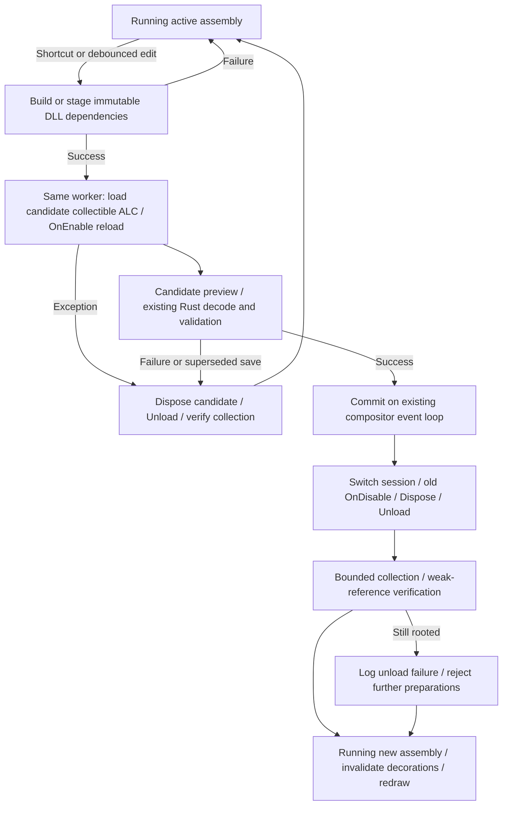

# Runtime reload: investigation and implementation

## Existing TypeScript behavior

The implementation does **not** have a source watcher or an external build step.
`CliArgs::parse` in `src/shojiwm/src/main.rs` parses `--dev` and forwards it via
`RuntimePathOptions` to `install_paths::development_paths`. It selects repository
runtime/config paths instead of installed paths. It is not a reload switch.

`src/shojiwm/src/input.rs` recognizes `Super+Shift+R` on key press, after checking
user key bindings, and calls `ShojiWM::reload_decoration_runtime` in `state.rs`.
The shortcut also works without `--dev`.

```text
Source saved                        (no automatic action)
Super+Shift+R
  → finalize compositor closing snapshots
  → old lifecycleDisable("reload") → collect JSON persisted state
  → EmbeddedDecorationEvaluator::fresh_like()
       → reset shared runtime cell, stop/join old runtime thread
       → invalidate pointer worker epoch/pending invocation
  → new lifecycleEnable("reload", persisted state)
       → new RustyScript/V8 isolate and module imports
       → user enable callback and registration payloads
  → load background effect configuration
  → replace evaluator and invalidate decorations/effect caches
```

This is **isolate replacement inside the compositor process**, not an external
TypeScript process restart and not re-import into a live old isolate. The
evaluator's shared cells and pointer-move worker survive; its isolate does not.
`embedded_runtime.rs::run_runtime` constructs a new `Runtime`. Its
`ShojiImportProvider` reads source and resolves public TS imports. RustyScript's
module loader transpiles imported TS/TSX during module loading; there is no
`npm build`/`tsc` stage in this reload path. A new isolate has a new module cache,
so changed imported submodules are re-read.

Syntax/import/initialization/enable errors are returned to Rust, logged and
shown through `ConfigErrorReport::hot_reload`; the compositor continues. Old
runtime **retention is not guaranteed**: `fresh_like()` has already destroyed
the old isolate in the shared cell. The evaluator variable retained on error
does not mean its old runtime survived. Background-config errors can happen
after new lifecycle registration payloads have already been consumed. This
path is not an atomic transaction and has no rollback to the old isolate.
The C# path improves failure retention without changing the TS path.

`tools/decoration-runtime.ts::runEmbeddedRuntime` handles `lifecycleDisable`
using `events.emitDisable`; selected JSON state is returned. `lifecycleEnable`
imports config/preload, emits enable with that state, and returns current
keybinding, pointer, input, event, output, workspace and process registration
payloads. The default `packages/config/src/index.tsx` persists the hybrid WM
snapshot and disposes/restores the corresponding controller.

### Ownership across generations

| Owner | State and reload behavior |
|---|---|
| Rust compositor | Wayland clients/surfaces, outputs, focus, placement, render/input infrastructure, socket listener and GPU resources survive. Closing snapshots are explicitly finalized; decoration/effect evaluation caches are invalidated. |
| Rust runtime integration | Compiled keybinding/event/input/process registration payloads live in compositor state and are replaced from runtime responses. Service supervision preserves matching services under `keep-if-unchanged`, and restarts `always-restart` services. |
| TS runtime generation | Imported config, JS objects, callback registries, signals, composition caches and scheduler/timer state are discarded with the isolate. User disable hooks may persist selected JSON state and release resources. |
| Shared embedded adapter | Pointer-move dispatcher/thread and state cells remain, with an epoch guard to reject stale asynchronous work. |
| Runtime-owned user IPC | `packages/shoji_wm/src/ipc.ts` closes listeners/connections via config cleanup; native IPC listener resources also close on isolate teardown. Existing IPC clients see disconnect and must reconnect. This is separate from the compositor's Wayland listener. |

Relevant regression tests already exist in `ssd/evaluator.rs`, including
submodule/keybinding reload, persisted layout/keyboard state, IPC file-descriptor
cleanup and pointer-worker reuse. `embedded_runtime.rs`, `evaluator.rs`, the
TypeScript runtime/config and its native composition/scheduler paths are not
modified for C# reload.

## C# decision and lifecycle

Selected: **collectible configuration ALCs inside the existing external worker**.
The CLR and transport stay alive across configuration reloads. The compositor
continues to own Rust/Smithay state and never hosts CoreCLR. No hostfxr/nethost,
backend traits, common language interfaces or new crate are introduced. TS/V8
implementation and lifecycle are unchanged. Metadata Update and `dotnet watch`
method patching are not used.



Only initialization or recovery from worker death creates a worker process.
Healthy reloads retain the same worker PID and pipes, with monotonically
increasing request IDs. The JSON envelope adds optional `configPath` generated
from the Rust serde source. Semantic commands are `prepareAssembly`,
`evaluateCandidatePreview`, `commitAssembly`, `abortAssembly` and
`shutdownAssemblies`; no CLR object/delegate/function pointer crosses the wire.
Normal render, lifecycle, handler and tree JSON remains compatible.

Preparation runs on the existing background reload thread. It stages/builds
config dependencies, asks the managed host to load and enable a candidate, and
validates cached live window snapshots through the existing Rust decoder.
Candidate previews suppress window actions and live callback registration.
Normal evaluations/handlers continue to target the active session until commit.
A Rust RAII pending lease aborts candidates rejected by validation, newer source
content, event delivery failure or cancellation. The old DLL directory remains
available throughout preparation. At commit, Rust clears old cached trees and
marks decorations dirty; generation-specific handler IDs reject stale callbacks.

Build, missing/broken assembly, entry-point, constructor, enable and preview
exceptions retain the active assembly. Managed exceptions become strings with
stage information (`assemblyLoad`, `initialization`, `reload`, `unload`) rather
than retained user Exception/Type instances. Cleanup errors go to stderr;
`OnDisable` failure still runs config disposal, and does not roll back a committed
new config. Incomplete ALC collection is reported explicitly and blocks further
preparations, preventing accumulation; collection can be retried after external
references are released.

## Responsibility and dependency separation

| File / module | Responsibility / dependencies |
|---|---|
| `ssd/dotnet/transport.rs` | Worker startup/termination and bounded NDJSON pipe I/O; standard library only. |
| `ssd/dotnet/assembly.rs` | Private immutable dependency staging and RAII directory cleanup; standard library only. |
| `ssd/dotnet/source.rs` | Source fingerprinting/build and .NET-specific path/options DTO; no compositor types or ALC commands. |
| `ssd/dotnet/reload.rs` | Serialized preparation/debounce and calloop publication; existing .NET integration glue. |
| `ssd/dotnet/protocol.rs` | Wire envelope; reuses existing ShojiWM snapshots, actions and tree DTOs. |
| `ssd/dotnet/evaluator.rs` | Existing DecorationEvaluator adapter, tree decode/validation, pending transaction lease, cache and error conversion. |
| `ConfigurationHost.cs` | Owns active/candidate generation, prepares/commits/aborts and verifies unload. No file watching or transport. |
| `ConfigurationGeneration.cs` | Owns loader and session; releases managed references, disables/disposes and requests unload. |
| `ConfigLoader.cs` | Collectible ALC, dependency resolver, shared API identity and native dependency loading. |
| `RuntimeSession.cs` | Per-generation config, window snapshots, delegate registry and action buffer. |
| `Program.cs` / `NdjsonTransport.cs` | Long-lived worker protocol loop and framing; no watcher or source build. |

The portable Rust operations are localized for later movement. Protocol/evaluator
still intentionally reference core snapshots/decoder, and the reload publisher
uses calloop; those are the existing integration edges, not an invented upstream
abstraction. CLI/runtime selection and public `IWindowConfig` are unchanged.
There is no new independent crate, backend/plugin discovery or generic backend
API. Runtime hosting remains OS child-process ownership: hostfxr-specific handle
layers would serve no purpose in this architecture.

## Resource ownership and unload

| Resource | Creator / owner | Release / reload lifetime |
|---|---|---|
| Worker child + pipe thread/FDs | Rust transport | Survives healthy reload; bounded termination/reap on failure or final drop. |
| Config/dependency stage | Rust assembly directory/evaluator | Candidate drop or last old evaluator reference after commit removes it. |
| ALC / resolver | Managed generation | `Unload()` after config/session cleanup; only weak references retained for verification. |
| Config / session | Managed generation | Active until switch; disable/dispose, clear references and detach before unload. |
| Handler delegates / window cache | RuntimeSession | Cleared on window close/disable/dispose; generation IDs never reused. |
| Config timers/tasks/threads/events/singletons | User config | User must cancel/await/join/unsubscribe/dispose; host calls `IAsyncDisposable` or `IDisposable` (async wins). |
| Config native dependencies | ALC via AssemblyDependencyResolver | Runtime owns library lifetime loaded via `LoadUnmanagedDllFromPath`; user owns any separate handles. |
| GCHandle / native callbacks / function pointers | None created by production bridge | Arbitrary config-created handles must be released by config disposal; never sent to Rust. |
| Assembly/Type/MethodInfo | Temporary loader locals | No managed entry-point/reflection cache is retained in the host. |

A partially failed `OnEnable` is disabled and disposed. Constructors that throw
must release resources they created before throwing. Config `OnDisable` remains
the existing semantic hook; optional BCL disposal adds cleanup without changing
the core configuration API. External effects and shared public-API/host statics
are not transactionally restored. User code must not place config references in
long-lived shared statics without disposing them.

ALC unload is cooperative. Non-inlined load/release/exception frames unwind
before weak-reference verification so JIT stack locals and user exceptions do
not produce false unload failures. Weak references track resurrection. At most
three collect/finalizer/collect passes occur at lifecycle boundaries; ordinary
rendering never forces GC. This follows Microsoft's
[assembly unloadability guidance](https://learn.microsoft.com/en-us/dotnet/standard/assembly/unloadability).

There is no guarantee that arbitrary user code unloads: stuck tasks, leaked
subscriptions/handles, or non-returning disposal/finalizers can retain an ALC or
wedge the worker. Rust retains its existing 2 s protocol deadline, then terminates
the worker and reports an error instead of deadlocking the compositor. Such a
worker cannot preserve the old config; manual reload or a watched edit starts
another worker. There is no automatic crash restart loop. Final process shutdown
has a best-effort 100 ms cleanup budget. Build cancellation/deadline (120 s),
process-group cleanup, source polling (100 ms), debounce (400 ms) and exclusion
rules remain unchanged.

## Verification

Verified on 2026-10-01 inside the sandbox with .NET SDK 10.0.112:

- **PASS** Release managed build: zero warnings/errors; 16 BCL-only tests.
- **PASS** `cargo build -p shoji_wm --offline`: normal compositor binary, no warnings.
- **PASS** Binding-generator freshness and 3 generator tests.
- **PASS** Actual worker NDJSON test with 12 same-process assembly reloads.
- **PASS** `cargo test --workspace --offline`: compositor 247 passed, 0 failed,
  3 ignored; other workspace tests/doc-tests passed.
- **PASS** Both opt-in .NET integration tests were also executed separately,
  including actual source rebuild/rollback and unchanged PID on healthy reload.

The tests run headlessly; no real Wayland session is needed.

| Result | Test | Verification |
|---|---|---|
| PASS | Managed repeated reload | 20 switches in one host; previous ALC weak references are collected, old handler IDs fail, shutdown disposes all 21 generations exactly once. |
| PASS | Managed resource fixture | Config owns a timer, cancellation-backed Task, thread, AppDomain event and GCHandle; disposal stops/releases all and ALC verification succeeds. |
| PASS | Managed failure/retry | Missing/broken DLL, no config entry point, constructor/enable/render exception preserve old tree; fixes reload; throwing disable still disposes/unloads. |
| PASS | Managed deliberate leak | Retained external event roots old ALC; diagnostic and prepare refusal; releasing reference permits collection/retry. |
| PASS | Python actual worker | 12 assembly replacements in one process, NDJSON requestId correlation, unique handler IDs, no unload warning. |
| PASS | Rust fake worker | 12 same-PID switches, rejected init/tree keep old PID/tree, cancelled pending lease aborts and removes staging. |
| PASS | Rust watcher | 15 rapid saves debounce to latest config; only one activation before acknowledgment. |
| PASS | Rust actual SDK build | Source edit changes decoded label with unchanged worker PID; syntax/enable errors preserve config; fixed source recovers; killed worker can be restarted. |

Commands:

```sh
dotnet build dotnet/ShojiWM.Tests/ShojiWM.Tests.csproj -c Release --disable-build-servers -m:1
dotnet run --project dotnet/ShojiWM.Tests/ShojiWM.Tests.csproj -c Release --no-build
python3 tools/test-dotnet-worker.py --configuration Release
python3 tools/generate-dotnet-bindings.py --check
python3 tools/test-dotnet-generator.py
cargo test -p shoji_wm 'ssd::dotnet'
SHOJI_TEST_DOTNET_RUNTIME="$PWD/dotnet/ShojiWM.Runtime/bin/Release/net10.0/ShojiWM.Runtime" \
  cargo test -p shoji_wm real_dotnet_source_reload -- --ignored --nocapture
```

**NOT RUN:** the driver-dependent EGL retirement test, a visual TTY/WInit
reload and a long-running compositor RSS benchmark. C# keybindings/event subscriptions/scheduler APIs are not yet
public APIs; config-owned BCL resources are tested instead.

## Follow-ups

Measure real compositor reload latency/RSS and add display smoke coverage.
Capability/version negotiation and persisted config state are still follow-ups.
The worker and shared API contract require a host rebuild/restart when changed;
only user assemblies and their private dependencies reload. Native handles and
external services need user cleanup contracts. Keep the current integration edges
until upstream defines its abstraction; only then select the crate/API boundary.
