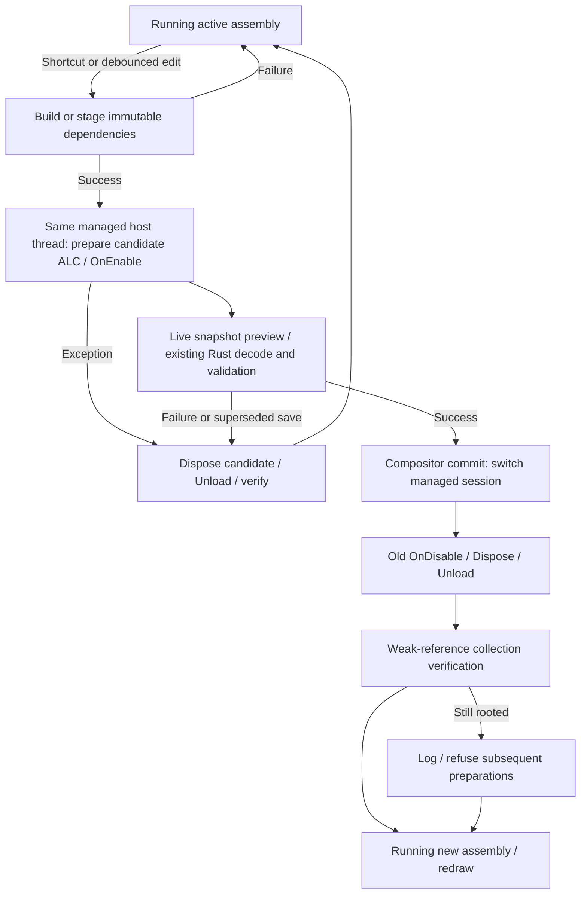

# Runtime reload: investigation and implementation

## Existing TypeScript behavior

The implementation does **not** have a source watcher or an external build step.
`CliArgs::parse` in `src/shojiwm/src/main.rs` parses `--dev` and forwards it via
`RuntimePathOptions` to `install_paths::development_paths`. It selects repository
runtime/config paths instead of installed paths. It is not a reload switch.

`src/shojiwm/src/input.rs` recognizes `Super+Shift+R` on key press, after checking
user key bindings, and calls `ShojiWM::reload_decoration_runtime` in `state.rs`.
The shortcut also works without `--dev`.

```text
Source saved                        (no automatic action)
Super+Shift+R
  → finalize compositor closing snapshots
  → old lifecycleDisable("reload") → collect JSON persisted state
  → EmbeddedDecorationEvaluator::fresh_like()
       → reset shared runtime cell, stop/join old runtime thread
       → invalidate pointer worker epoch/pending invocation
  → new lifecycleEnable("reload", persisted state)
       → new RustyScript/V8 isolate and module imports
       → user enable callback and registration payloads
  → load background effect configuration
  → replace evaluator and invalidate decorations/effect caches
```

This is **isolate replacement inside the compositor process**, not an external
TypeScript process restart and not re-import into a live old isolate. The
evaluator's shared cells and pointer-move worker survive; its isolate does not.
`embedded_runtime.rs::run_runtime` constructs a new `Runtime`. Its
`ShojiImportProvider` reads source and resolves public TS imports. RustyScript's
module loader transpiles imported TS/TSX during module loading; there is no
`npm build`/`tsc` stage in this reload path. A new isolate has a new module cache,
so changed imported submodules are re-read.

Syntax/import/initialization/enable errors are returned to Rust, logged and
shown through `ConfigErrorReport::hot_reload`; the compositor continues. Old
runtime **retention is not guaranteed**: `fresh_like()` has already destroyed
the old isolate in the shared cell. The evaluator variable retained on error
does not mean its old runtime survived. Background-config errors can happen
after new lifecycle registration payloads have already been consumed. This
path is not an atomic transaction and has no rollback to the old isolate.
The C# path improves failure retention without changing the TS path.

`tools/decoration-runtime.ts::runEmbeddedRuntime` handles `lifecycleDisable`
using `events.emitDisable`; selected JSON state is returned. `lifecycleEnable`
imports config/preload, emits enable with that state, and returns current
keybinding, pointer, input, event, output, workspace and process registration
payloads. The default `packages/config/src/index.tsx` persists the hybrid WM
snapshot and disposes/restores the corresponding controller.

### Ownership across generations

| Owner | State and reload behavior |
|---|---|
| Rust compositor | Wayland clients/surfaces, outputs, focus, placement, render/input infrastructure, socket listener and GPU resources survive. Closing snapshots are explicitly finalized; decoration/effect evaluation caches are invalidated. |
| Rust runtime integration | Compiled keybinding/event/input/process registration payloads live in compositor state and are replaced from runtime responses. Service supervision preserves matching services under `keep-if-unchanged`, and restarts `always-restart` services. |
| TS runtime generation | Imported config, JS objects, callback registries, signals, composition caches and scheduler/timer state are discarded with the isolate. User disable hooks may persist selected JSON state and release resources. |
| Shared embedded adapter | Pointer-move dispatcher/thread and state cells remain, with an epoch guard to reject stale asynchronous work. |
| Runtime-owned user IPC | `packages/shoji_wm/src/ipc.ts` closes listeners/connections via config cleanup; native IPC listener resources also close on isolate teardown. Existing IPC clients see disconnect and must reconnect. This is separate from the compositor's Wayland listener. |

Relevant regression tests already exist in `ssd/evaluator.rs`, including
submodule/keybinding reload, persisted layout/keyboard state, IPC file-descriptor
cleanup and pointer-worker reuse. `embedded_runtime.rs`, `evaluator.rs`, the
TypeScript runtime/config and its native composition/scheduler paths are not
modified for C# reload.

## C# in-process hosting decision

CoreCLR is initialized by hostfxr through netcorehost 0.22.0. Only the permanent
ShojiWM.Runtime.dll bootstrap exports native entry points; config DLLs remain
collectible ALCs created by ConfigLoader. No common backend trait, upstream
abstraction, plugin system or V8 redesign is introduced. ConfigurationHost,
ConfigurationGeneration, RuntimeSession and the transaction commands retain
their assembly lifecycle semantics. File monitoring/builds stay separate.



## Ownership and responsibilities

| Resource | Owner | Lifetime / release |
|---|---|---|
| hostfxr / CoreCLR | Rust bootstrap initialization | Process lifetime. hostfxr retained permanently; context close is not CLR shutdown. No dlclose/restart. |
| Bootstrap function pointers / API assembly | Permanent managed bootstrap and Rust OnceLock | Process lifetime. No native pointer into a user config DLL. Bootstrap path changes require compositor restart. |
| Managed host thread / Rust channel | InProcessDotNetHost | Backend host lifetime. Init/create/invoke/destroy occur on this thread, destruction joins it. No execution timeout/abandonment. |
| GCHandle → HostOwner → ConfigurationHost | Managed CreateHost, Rust RAII owns opaque handle | Freed in DestroyHost finally after Dispose, on the creating thread. |
| Request bytes | Rust | Borrowed by managed entry point only until call return. |
| Response/error buffer | Managed NativeMemory.Alloc | Rust copies; RAII invokes managed FreeBuffer on all returned buffers. |
| Config/dependency staging | Rust GenerationDirectory/evaluator | Lives through abort/disposal; removed after last generation reference. |
| Active/candidate config/session/ALC | ConfigurationGeneration | Switch/abort/shutdown clears references, disables, disposes and calls Unload; only weak references retained afterward. |
| Window snapshots/handler delegates | RuntimeSession | Cleared on close/disable/disposal; generation IDs reject stale callbacks. |
| Timers/tasks/threads/events/GCHandles/native callbacks | User config | Must cancel/await/join/unsubscribe/free in IDisposable/IAsyncDisposable (async takes precedence). |
| Assembly/Type/MethodInfo / exception objects | Managed call frames | Not cached across unload; diagnostics flatten to strings and frames unwind before GC verification. |
| Source watcher/builds | Rust source/reload modules | Poll100ms, debounce400ms, one build/pending activation; build subprocess timeout120s/cancellation kills its own process group. |
| Wayland/Smithay/output/window/focus/render/input | Existing compositor | Unchanged; survives config generations, decorations invalidated at commit. |

Bootstrap loading and errors are confined to host.rs. Immutable staging is in
assembly.rs; source hashing/builds in source.rs; build group termination in
process.rs. Evaluator/protocol and calloop reload publication remain the narrow
existing ShojiWM integration edges. No backend implementation crate was split.
NativeHost.Tests is only a CI harness importing the production hosting source.

## Rollback and cooperative unload

Build, missing/broken/no-entry DLL, constructor, OnEnable, preview exceptions and
invalid Rust trees retain the active generation. A pending RAII lease aborts
unactivated candidates (including superseded saves). Preview emits no live
actions/handlers. Commit clears Rust caches and switches sessions before old
disable/disposal. Cleanup exceptions are reported; they do not roll back a
successful commit. Partially failing enable is disabled/disposed; throwing
constructors clean their own partially allocated resources.

Non-inlined load/release frames unwind before weak-reference verification;
WeakReference tracks resurrection. Up to three GC/finalizer/GC passes occur at
lifecycle boundaries, never ordinary rendering. Pending roots cause diagnostics
and prepare refusal rather than accumulating generations. Release the root to
permit collection/retry. This remains cooperative, following Microsoft's
[assembly unloadability guidance](https://learn.microsoft.com/en-us/dotnet/standard/assembly/unloadability).

C# configuration runs in the compositor process. The old pipe deadlines,
worker kill/restart and 100ms final worker cleanup budget are removed. Rust
cannot safely kill a managed thread or unload CoreCLR. A stuck callback,
constructor, disposal or finalizer can block the host/compositor; native crashes,
FailFast and Environment.Exit share ShojiWM's fault domain. Ordinary exceptions
are contained by ConfigurationHost/NativeEntryPoint; no managed exception can
unwind through the native entry point. Shared statics/side effects are not
transactionally restored. Bootstrap/ABI/protocol failures do not start a CLR
restart loop; errors explicitly require a ShojiWM restart.

## Verification

Headless tests require no Wayland session. Commands are in [README.md](README.md).
The native host harness checks real hostfxr/runtimeconfig/bootstrap exports and
API identity, 20 same-host reloads, action dispatch, old handler rejection,
constructor/enable/render/broken/missing/no-entry rollback, output/input limits,
deliberate leaked event rooting/refusal/release/retry, no worker children and
one managed caller thread across multiple Rust callers.

Managed tests check actual WeakReference collection after 20 swaps, exactly-once
disposal, and config-owned Task/thread/timer/event/GCHandle cleanup. The native
ABI tests check borrowed UTF-8 inputs, allocator-matched frees, null/invalid
inputs, requestId preservation and exception containment. Rust unit tests
check DTO fixture compatibility, correlation/tree validation, immutable stages,
source hash exclusions and build process-group cancellation. Opt-in compositor
integration tests check source rebuild success, syntax/initialization/tree
rollback, 15 rapid saves/one pending activation, candidate lease abort and 12
shared-host replacements with old staging directory removal.

Visual WInit/TTY execution, long-running RSS/native handle trends, and arbitrary
user native libraries are not covered by these headless tests. ALC collection
and fixture resource teardown do not prove every config can unload.

Verified on 2026-10-01 inside the sandbox with SDK 10.0.112:

| Result | Check |
|---|---|
| PASS | Release managed build, zero warnings/errors; 15 managed tests including native ABI calls. |
| PASS | Actual hostfxr native harness: 20 swaps, rollback, leak/refusal/release/retry, output size rejection, same caller thread, no child workers; legacy apphost spelling resolves the DLL. |
| PASS | Rust .NET unit tests: 7 passed, 2 opt-in integrations ignored in the ordinary run. |
| PASS | Both opt-in compositor integrations executed separately: real decoder/layout/delegate actions and SDK source rebuild/rollback/rapid saves/staging cleanup. |
| PASS | Workspace tests: compositor 241 passed, zero failures, 3 ignored; other crates/doc tests passed. |
| PASS | `cargo build -p shoji_wm --offline`, no warnings; normal debug binary updated. |
| PASS | Generated DTO freshness and 3 binding-generator tests. |
| NOT RUN | Visual WInit/TTY run, long-running RSS/native resource measurements, Nix build. |

The workspace run preceded the final apphost-name regression test; that added
case passed in the subsequent .NET unit run and actual hosting harness. Ignored
.NET integrations were explicitly executed; the remaining ignored EGL/graphics
check was not run. Expected unload diagnostics come from deliberate leak tests.
