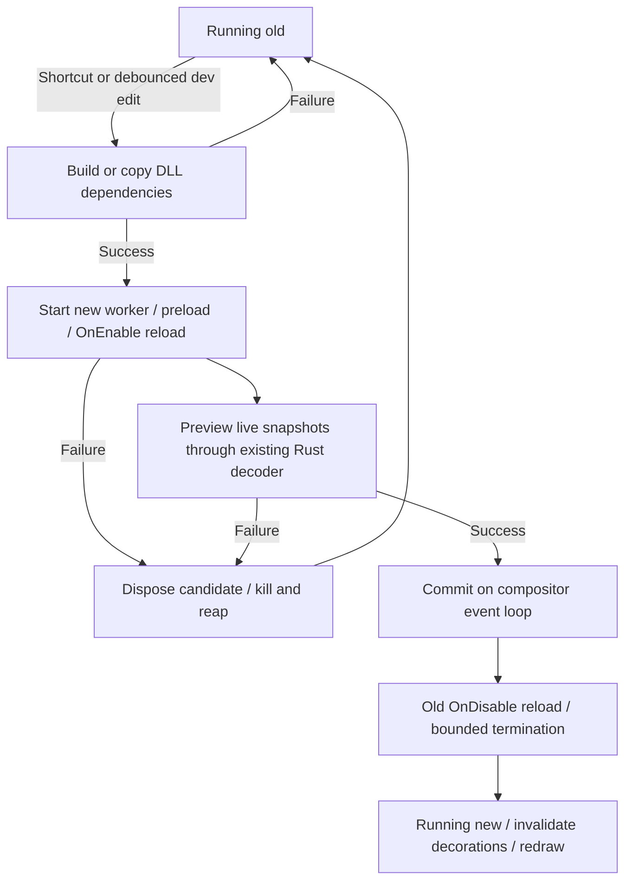

# Runtime reload: investigation and implementation

## Existing TypeScript behavior

The implementation does **not** have a source watcher or an external build step.
`CliArgs::parse` in `src/shojiwm/src/main.rs` parses `--dev` and forwards it via
`RuntimePathOptions` to `install_paths::development_paths`. It selects repository
runtime/config paths instead of installed paths. It is not a reload switch.

`src/shojiwm/src/input.rs` recognizes `Super+Shift+R` on key press, after checking
user key bindings, and calls `ShojiWM::reload_decoration_runtime` in `state.rs`.
The shortcut also works without `--dev`.

```text
Source saved                        (no automatic action)
Super+Shift+R
  → finalize compositor closing snapshots
  → old lifecycleDisable("reload") → collect JSON persisted state
  → EmbeddedDecorationEvaluator::fresh_like()
       → reset shared runtime cell, stop/join old runtime thread
       → invalidate pointer worker epoch/pending invocation
  → new lifecycleEnable("reload", persisted state)
       → new RustyScript/V8 isolate and module imports
       → user enable callback and registration payloads
  → load background effect configuration
  → replace evaluator and invalidate decorations/effect caches
```

This is **isolate replacement inside the compositor process**, not an external
TypeScript process restart and not re-import into a live old isolate. The
evaluator's shared cells and pointer-move worker survive; its isolate does not.
`embedded_runtime.rs::run_runtime` constructs a new `Runtime`. Its
`ShojiImportProvider` reads source and resolves public TS imports. RustyScript's
module loader transpiles imported TS/TSX during module loading; there is no
`npm build`/`tsc` stage in this reload path. A new isolate has a new module cache,
so changed imported submodules are re-read.

Syntax/import/initialization/enable errors are returned to Rust, logged and
shown through `ConfigErrorReport::hot_reload`; the compositor continues. Old
runtime **retention is not guaranteed**: `fresh_like()` has already destroyed
the old isolate in the shared cell. The evaluator variable retained on error
does not mean its old runtime survived. Background-config errors can happen
after new lifecycle registration payloads have already been consumed. This
path is not an atomic transaction and has no rollback to the old isolate.
The C# path improves failure retention without changing the TS path.

`tools/decoration-runtime.ts::runEmbeddedRuntime` handles `lifecycleDisable`
using `events.emitDisable`; selected JSON state is returned. `lifecycleEnable`
imports config/preload, emits enable with that state, and returns current
keybinding, pointer, input, event, output, workspace and process registration
payloads. The default `packages/config/src/index.tsx` persists the hybrid WM
snapshot and disposes/restores the corresponding controller.

### Ownership across generations

| Owner | State and reload behavior |
|---|---|
| Rust compositor | Wayland clients/surfaces, outputs, focus, placement, render/input infrastructure, socket listener and GPU resources survive. Closing snapshots are explicitly finalized; decoration/effect evaluation caches are invalidated. |
| Rust runtime integration | Compiled keybinding/event/input/process registration payloads live in compositor state and are replaced from runtime responses. Service supervision preserves matching services under `keep-if-unchanged`, and restarts `always-restart` services. |
| TS runtime generation | Imported config, JS objects, callback registries, signals, composition caches and scheduler/timer state are discarded with the isolate. User disable hooks may persist selected JSON state and release resources. |
| Shared embedded adapter | Pointer-move dispatcher/thread and state cells remain, with an epoch guard to reject stale asynchronous work. |
| Runtime-owned user IPC | `packages/shoji_wm/src/ipc.ts` closes listeners/connections via config cleanup; native IPC listener resources also close on isolate teardown. Existing IPC clients see disconnect and must reconnect. This is separate from the compositor's Wayland listener. |

Relevant regression tests already exist in `ssd/evaluator.rs`, including
submodule/keybinding reload, persisted layout/keyboard state, IPC file-descriptor
cleanup and pointer-worker reuse. `embedded_runtime.rs`, `evaluator.rs`, the
TypeScript runtime/config and its native composition/scheduler paths are not
modified for C# reload.

## C# decision and lifecycle

Selected: **external runtime process replacement**. The semantic boundary is a
replaceable runtime generation, just as TS has replaceable isolates. Since .NET
already runs out of process, a fresh worker avoids collectible-ALC reachability,
static field, timer and task unloading problems. Metadata Update and
`dotnet watch` method patching are not used. The existing `RuntimeSession` /
`IWindowConfig.OnEnable/OnDisable` are the activation/disposal boundary; no
second C# lifecycle hierarchy is necessary.



`ssd/dotnet_reload.rs::DotNetReloadManager` owns one serialized background worker,
one source fingerprint and one pending activation. No build runs in the
compositor event loop. Content polling/debounce is an opt-in C# extension;
there is no existing TS watcher to reuse. `--dotnet-project` specifies an
optional project to build in Release, and `--runtime-dir` can override its watch
root. DLL-only configurations are still supported. Build output and staged
dependencies are private generation directories released with their evaluator.
The initial config is also shadow-copied so a later build cannot rewrite its
mapped assembly. Unsupported symlink dependencies are reported as errors.

`state.rs::finish_dotnet_reload` commits only after candidate preload, enable,
and preview validation succeeded. Input/output state is refreshed at commit.
Candidate preview calls suppress compositor actions/handler registration as in
the existing preview contract. Candidate enable window actions are rejected
rather than applied before commit. Previously cached live snapshots are used
for validation; windows that appear later render through the ordinary path.
The candidate's private user-code effects during preview are its responsibility.

The old worker remains active throughout build/preparation failure. Only after
commit is it retired, with a 100 ms disable deadline and process termination.
Worker/build children are launched in their own process groups; cancellation
uses the system `kill` utility and reaps the direct child. Detached processes or
external file/network effects created by arbitrary user code are outside the
rollback contract. CLR statics, tasks, timers and delegates in the old worker
cannot survive its exit. Handler IDs include a fresh per-session generation
identifier, so stale IDs never resolve to a new generation's callback.

NDJSON message shapes, camelCase fields, requestId correlation and the existing
wire decoder are unchanged. There is no socket reconnect protocol: Rust owns
the new child pipes and does not reuse the outgoing transport. Worker crashes
produce bounded protocol errors, quarantine that generation and leave the
compositor alive. Manual reload or a later watched edit can recover it; this
implementation does not continuously restart a crashing config.

## Verification

Verified on 2026-10-01 with .NET SDK 10.0.112, inside the sandbox:

- **PASS** Release .NET build: zero warnings/errors; C# harness 13 tests.
- **PASS** `cargo build -p shoji_wm --offline` (normal compositor binary).
- **PASS** Generated-binding freshness and generator tests (3 tests).
- **PASS** Real worker NDJSON / dynamic assembly / composition smoke test.
- **PASS** `cargo test --workspace --offline`: compositor 246 passed, 0 failed,
  3 ignored; other workspace tests and doc-tests passed.
- **PASS** Both ignored .NET integration tests were separately run against the
  latest workspace test binary: 2 passed. This includes actual source watching,
  build-error and initialization-error retention, recovery, and worker death.
- **PASS** Four fake-worker/staging/watcher tests, including 12 generation swaps
  and 15 rapid saves, are included in the workspace result above.
- **NOT RUN** Driver-dependent EGL program-retirement test, a real display
  hot-reload smoke test, and a long-running compositor RSS benchmark.

The tests do not require a real Wayland session:

| Test | What it checks |
|---|---|
| `watch_hash_tracks_source_content_and_ignores_build_outputs` | Content changes are detected; `obj` build output is excluded. |
| `staging_is_immutable_and_removed_after_last_reference` | DLL replacement cannot change an active copy; last-reference cleanup removes its directory. |
| `rejected_generation_keeps_old_worker_and_twelve_swaps_reap_resources` | Initialization errors and invalid composition retain old PID/tree; 12 swaps reap every retired PID and staging directory. |
| `watcher_debounces_rapid_saves_and_has_one_pending_activation` | 15 rapid saves produce the latest tree; no second activation occurs before commit acknowledgement. |
| `real_dotnet_source_reload_rolls_back_build_and_initialization_failures` | Actual saved C# builds/load/decode, syntax-error rollback, initialization-exception rollback, fixed-source recovery, worker-crash recovery. |
| C# `handler IDs do not cross runtime generations` | Old delegate IDs cannot invoke the new session's delegate. Existing scoped-handler/lifecycle tests remain active. |

Run the fake-worker tests with:

```sh
cargo test -p shoji_wm dotnet_reload
```

Run the actual .NET watcher/build integration after building the worker:

```sh
dotnet build dotnet/ShojiWM.Tests/ShojiWM.Tests.csproj -c Release --disable-build-servers -m:1
SHOJI_TEST_DOTNET_RUNTIME="$PWD/dotnet/ShojiWM.Runtime/bin/Release/net10.0/ShojiWM.Runtime" \
  cargo test -p shoji_wm real_dotnet_source_reload -- --ignored --nocapture
```

The real integration test creates temporary configs instead of editing the
user's example. The repeated-generation test proves old process/resource
retirement; it is not a compositor RSS growth benchmark. Keybindings/event
subscriptions/scheduler timers are not yet public C# APIs, so duplication of
those registrations is not claimed as tested. A real display session remains
necessary to verify visible decoration changes with running applications.

## Follow-ups

Add opt-in lifecycle persisted-state DTOs, capability/version negotiation and
visual compositor tests. Consider a proper filesystem event watcher if content
polling becomes expensive for large projects. Config public API/worker updates
still require rebuilding the host, and NuGet/assets outside the watched root
need a manual reload or explicit watch-root selection. Measure compositor
memory and frame latency under real workloads: build/prepare is asynchronous,
but ordinary evaluations remain synchronous JSON round trips, and retiring a
worker can occupy the commit turn for up to 100 ms. Transactional TS reload is
a separate improvement requiring care around its shared runtime cell and
pointer dispatcher; this change deliberately leaves that behavior intact.
